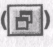
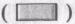
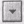

# **<u>Лабораторна робота №1</u>**

## **Тема**

Ознайомлення з комп’ютером і операційною системою MS Windows. Вікна та
дії над ними. Властивості робочого столу, вікна, папки та диска.

## **Мета**

Уміти входити в систему, користуватися папкою „Мій комп’ютер”, панеллю
задач, виконувати дії з вікнами, налаштовувати піктограми, вікно папки,
робочий стіл.

## **Словник**

Мій комп'ютер Мой компьютер My computer

Пуск Пуск Start

Вигляд Вид View

Великі значки Крупные значки Large icons

Список Список List

Таблиця Таблица Details

Малі значки Мелкие значки Small icons

Зверху — донизу Сверху вниз Tile Horizontally

Згорнути всі Свернуть все Minimize All

Властивості Свойства Properties

Фон/тло Фон Background

Заставка Заставка Screen Saver

Параметри Параметры Options

Огляд Обзор Browse

Скасувати Отмена Cancel

Закінчити роботу Завершение работы Shut Down

Вимкнути Выключить Switch off

Перезавантажити Перезагрузить Restart

## **Хід роботи**

1.  **Відкрийте вікно об'єкта «Мій комп’ютер».** Двічі клацніть над його
    піктограмою лівою клавішею миші.

2.  **Розгорніть вікно на весь екран.** Для цього клацніть на
    кнопці 

3.  **Надайте вікну попереднього
    вигляду****Мінімізуйте
    вікно**

4.  **Розгорніть мінімізоване вікно.** Клацніть над кнопкою «Мій
    комп'ютер» у панелі задач.

5.  **Закрийте вікно** Закрити вікно можна
    одним з вищеописаних способів.

<!-- -->

6.  **Знову відкрийте вікно об'єкта «Мій комп’ютер».**

7.  **Змініть розміри вікна.** Чи є у вікні смуги прокручування? Якщо у
    вікні видно всі піктограми, то смуг прокручування не буде.

8.  **Зменшіть розміри вікна, щоб з’явились смуги про­кручування.**

9.  **Поекспериментуйте зі смугами прокручування.** Перетягуйте бігунці
     або клацайте лівою клавішею
    миші на кнопках, (для вертикального
    перегляду) тощо.

10. **Виберіть найоптимальніший, на вашу думку, розмір вікна.**

11. **Активізуйте (викличте) контекстне меню робочого поля вікна об'єкта
    «Мій комп’ютер».** Щоб викликати контекстне меню елемента (тут -
    робочого поля об'єкта «Мій комп’ютер»), треба над елементом (тут -
    над чистим полем вікна) клацнути правою клавішею миші. Розгля­ньте
    доступні команди.

12. **Вивчіть способи зображення піктограм (значків) у вікні.** Є
    декілька способів зображення піктограм у вікні: великі значки
    (плитка), малі, список, таблиця (детально), ескіз сто­рінки. Виберіть
    у контекстному меню пункт ВИГЛЯД, перейдіть у його підменю і
    виберіть Значки, а потім — СПИСОК. Спосте­рігайте за змінами у
    робочому полі. Спосіб ЕСКІЗ СТОРІНКИ використовують для відображення
    значків графічних чи вебфайлів — значок матиме вигляд картинки з
    файлу.

13. **Виконайте пункти 12 - 13, щоб задати інші три способи зображення
    піктограм.** Відобразіть піктограми у вигляді таблиці (пункт
    Таблиця). *Вивчіть характеристики (властивості) декількох об'єктів:
    назву, тип, обсяг.*

14. **Відобразіть піктограми різними способами, але тепер користуйтеся
    засобами <u>головного меню вікна.</u>** Виберіть в головному меню
    пункт ВИГЛЯД і потрібний підпункт. Яке розташування піктограм Вам
    більше до вподоби?

15. **Увімкніть / вимкніть панель інструментів і рядок стану вікна.**
    Скористайтеся відповідними командами з пункту Вигляд го­ловного меню.
    Вмикання/вимикання відбувається шляхом по­вторного виконання
    потрібної команди. Увікмнений режим по­значений «пташкою» або
    кружечком ліворуч від назви команди. Простежте, щоб для панелі
    інструментів був увімк­нений режим відображення звичайних кнопок і
    адресного рядка. Ознайомтесь з призначенням кнопок на панелі. Для
    цього наведіть на непідписані кнопки вказівник миші, отри­майте
    підказку і *вивчіть назви декількох. Вивчіть інформацію з рядка
    стану.*

16. **Відкрийте вікно диска D: або іншого.** Щоб відкрити вікно диска,
    двічі клацніть мишею на його піктограмі.

17. **Дослідіть властивості диска: обсяг диска, а також обсяг у байтах і
    відсотках вільного місця на диску.** Для цього клацніть правою
    клавішею миші на чистому полі та виберіть пункт Властивості.
    Закрийте діалогове вікно.

18. **Дослідіть вікно папки, відкривши будь-яку папку на диску.**
    Відкрийте папку, двічі клацнувши на її піктограмі. Виконайте команди Вигляд -> Значки. Змініть роз­ташування значків у вікні, застосувавши команду Вигляд -> Упорядкувати значки і вибравши по черзі декілька способів упорядкування: за іменем, за обсягом, за датою внесення останніх змін, групами, автоматично, вирівняти. Змініть розташування значків методом перетягування, вимкнувши режим автоматично, якщо це можливо у вашій конкретній ситуації.

19. **Дослідіть властивості папки. Відкрийте чотири будь-які папки (можна на різних дисках) у чотирьох вікнах, а не послідовно в одному вікні.** У Windows 95, щоб на екрані було декілька вікон, а не одне останнє вікно, потрібно задати відповідний режим командами Вигляд -> Властивості папки. У Windows 98 розгляньте закладку Загальні, виберіть радіо-кнопку На основі вибраної настройки, натисніть на кнопку Налаштування і з-поміж способів огляду папок виберіть режим Відкривати кожну папку в окремому вікні, а також виберіть веб-стиль (відкривати одним клацанням миші, вибирати вказівником миші) чи звичайний стиль (відкривати подвійним клацанням, вибирати одним клацанням) користування мишею. У Windows XP для цього виконайте команди Сервіс Влас­тивості папки... і задайте потрібні режими на закладці Загальні. Тут також можна задати чи скасувати відображення Області зі списком задач у робочому полі вікна, а також стиль користування мишею.

20. **Змініть стиль користування мишею зі звичайного на веб-стиль,
    поекспериментуйте з ним і поверніться до попереднього стилю.**

21. **Зробіть активними почергово інші вікна.** Для цього потрібно
    клацнути в межах наступного вікна.

22. **Упорядкуйте вікна на екрані каскадом.** Відшукайте <u>вільне
    місце</u> на панелі задач і клацніть на ньому правою клавішею миші.
    Якщо вільного місця немає, то спочатку розтягніть вікно панелі
    задач. Виберіть у контекст­ному меню пункт Каскадом.

23. **Упорядкуйте вікна командою Вікна** зверху-донизу, **а потім —**
    Зліва-направо. *Яке розташування вікон з трьох можливих Вам більше
    до вподоби?*

24. **Виберіть розташування вікон каскадом. Зробіть активним вікно „Мій
    комп’ютер”.**

25. **Згорніть (мінімізуйте) усі вікна.** У контекстному меню панелі
    задач виконайте команду Згорнути всі чи Показати робочий стіл.

26. **Розгорніть мінімізоване вікно «Мій комп’ютер». Зменшіть розміри
    вікна до квадратного вигляду і перетягніть вікно у центр екрана.**

27. **Закрийте вікно «Мій комп’ютер».**

28. **Закрийте всі мінімізовані вікна об'єктів, кнопки яких є на панелі
    задач.**

29. **Дослідіть контекстне меню робочого столу.** На чистому місці
    екрана клацніть правою клавішею миші — отримаєте контекстне меню
    робочого столу. Скасуйте авто­матичне упорядкування значків і змініть
    розташування значків методом їх перетягування.

30. **Дослідіть властивості робочого столу. Виконайте нала­штовування
    робочого столу з дозволу викладача. Ознайомтеся із <u>закладками</u>
    діалогового вікна Влас­тивості екрана.** У контекстному меню робочого
    столу виберіть пункт Власти­вості. Вікно, яке з'явиться, називають
    *діалоговим вікном влас­тивостей екрана.* Воно має декілька
    *закладок:* Фон (Тло), Заставка, Оформлення, Web, Плюс або Internet,
    Параметри (На лаштування) залежно від версії ОС. Виберіть закладку
    Фон чи Робочий стіл і поекспериментуйте з рисунком робочого столу
    (шпалерами). Виберіть у списку назву рисунка: Ліс, Хмари, Marble,
    Leaves, Plus! (клацнувши на ній) і натисніть на кнопки Розмножити та
    Застосувати. Бажано запам'ятати і відновити стартовий рисунок.
    Зверніть увагу на наявність кнопки Огляд – за її допомогою можна
    знайти у файловій системі будь-який графічний файл і ство­рити нові
    шпалери. Виберіть закладку Заставка і поекспериментуйте з екранними
    заставками: Вічний двигун, Геометричний вальс, Скрізь космос,
    Об'ємний текст, Біжучий рядок чи іншими. Задайте час бездіяльності –
    1 хв. Обов'язково натисніть на кнопку Пара­метри і поміняйте
    параметри, зокрема, працюючи з текстовими заставками, введіть свій
    текст – деяке ім'я тощо. Зробивши вибір, натисніть на кнопку ОК.
    Тепер на закладці Оформлення поекспериментуйте з кольо­ровим
    оформленням кожного елемента вікна: спочатку розгля­ньте існуючі
    схеми: Морська, Рожева, Бузкова, а потім помі­няйте колір будь-якого
    елемента, клацнувши над ним і на кнопках вибору кольору для фону,
    тексту тощо. Змін не фіксуйте - перейдіть на іншу закладку або
    натисніть на кнопку Скасувати (не рекомендуємо на навчальних
    комп'ю­терах вносити такі зміни, тому не натискайте на кнопку ОК). На
    закладці Параметри знайдіть і перепишіть у звіт характе­ристику
    роздільної здатності екрана: 640x480 або 800x600, або 1024x768.
    Високу роздільну здатність використовують під час роботи з
    графічними програмами, а в інших випадках користу­ються середньою —
    тоді значки на екрані більші. (*Попереджен­ня:* не можна змінювати
    роздільну здатність без дозволу викладача). Закрийте вікно
    налаштування екрана.

31. **Закінчіть роботу.**

## **Висновки**

Ви ознайомилися з поняттями *операційна система, диск, папка, файл,
об'єкт, вікно об'єкта, піктограма, діалогове вікно.* Піктограма
репрезентує об'єкт. Вікно розкриває зміст об'єкта. З вікном можна
виконувати такі дії: 1) відкривати, 2) закривати, 3) мінімізувати, 4)
перетягувати, 5) змінювати розміри, 6) активі­зувати, 7) налаштовувати.

Вікно складається з елементів, над якими можна вико­нувати дії, визначені
в контекстних меню елементів.

Контекстне меню об'єкта чи вибраного елемента вікна ви­кликають
натисканням правої клавіші миші.

Дію над об'єктом можна виконати лише вибравши його.

Піктограми у вікні можна відображати різними способами. Якщо їх мало, то
варто вибирати Значки, якщо багато, то — СПИСОК, а якщо файли графічні —
Ескіз. <u>Значки</u> можна переміщати у вікні, вимкнувши режим їх
автоматичного упорядкування.

## **Контрольні запитання**

1. Яке призначення об'єкту «Мій комп’ютер»?

2. Яке призначення панелі задач?

3. Що таке ярлик?

4. Яке призначення піктограм?

5. З чого складається вікно об'єкту?

6. Які необов'язкові елементи вікна?

7. Яке призначення смуг прокручування?

8. Які дії можна виконувати з вікном?

9. Для чого вікно мінімізують?

10. Як можна змінити розташування вікна на екрані?

11. Чим відрізняється активне вікно від пасивного?

12. Як зробити вікно активним?

13. Для чого призначене контекстне меню?

14. Як відкрити папку?

15. Як розгорнути вікно на весь екран?

16. Як змінити розміри вікна?

17. Як виконати перетягування за допомогою миші?

18. Як активізувати контекстне меню об'єкту?

19. Що таке робочий стіл?

20. Як закрити папку (вікно)?

21. Яке призначення програми сканування диску?

22. Яке призначення комбінації клавіш **Alt+F4?**

23. Як можна відобразити піктограми у вікні?

24. Яка перевага розташування піктограм у вигляді таблиці?

25. Як увімкнути / вимкнути панель інструментів?

26. Яке призначення рядка стану?

27. Як дослідити властивості диску?

28. Як закрити мінімізовані об'єкти?

29. Як виконати налаштування робочого столу?

30. Як правильно вимикати комп'ютер?

31. Які рисунки робочого столу та екранних заставок ви знаєте?

32. Які кнопки містить панель задач?

33. Якими способами можна розташувати вікна на екрані?

34. Що таке повний шлях до файлу?

35. Які символи не можна використовувати у назвах файлів?

